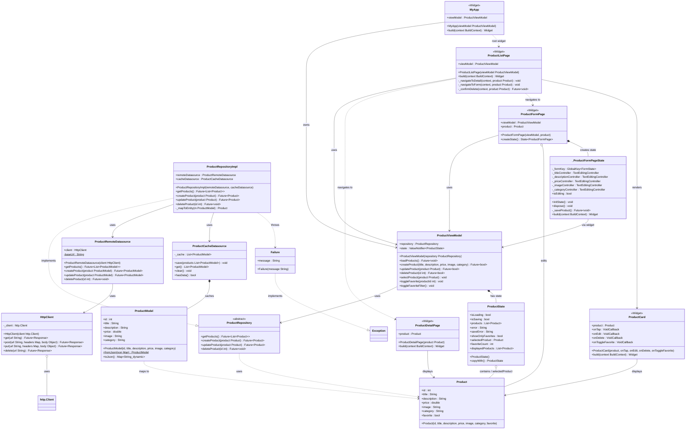

# Diagrama de Classes — att_04_mobile

Diagrama gerado a partir do PlantUML em `docs/uml/diagrama_classes.puml`.
Representa a arquitetura MVVM + Clean Architecture do aplicativo Flutter de CRUD de Produtos.

